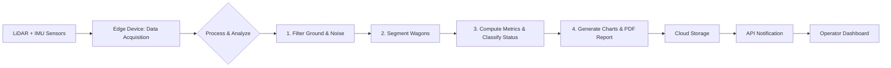

# IWLARS Project Development Plan

## 1. Introduction & Vision

The **Intelligent Wagon Load Analysis & Reporting System (IWLARS)** is an end-to-end, automated platform for analyzing the load status of moving train wagons using LiDAR and IMU sensors. Its goal is to deliver real-time, actionable insights for logistics, safety, and operational efficiency in the railway sector. The system covers the entire pipeline: from sensor data acquisition, through advanced analytics, to PDF report generation and cloud distribution, with optional dashboard and API integration.

## 2. Phased Development Roadmap

Development is structured into four major phases, each with clear deliverables and milestones:

### Phase 1: Environment & Sensor I/O Module
- **Setup:**
  - Initialize Git repository, Dockerfile, and CI/CD pipelines (GitHub Actions).
  - Define dependencies in `requirements.txt` (Open3D, NumPy, Pandas, FastAPI, Matplotlib, WeasyPrint, etc.).
  - Establish folder structure: `src/`, `tests/`, `docs/`, `data/`.
- **Sensor Simulation:**
  - Implement file-based data loader in `src/sensors/data_loader.py` for LiDAR (.pcd) and IMU (.LAS) files.
  - Optionally, add socket-based loader for real-time simulation.
- **Validation:**
  - Write a script in `src/main.py` to load and visualize point clouds using Open3D.
  - Unit tests to ensure correct data loading and visualization.

### Phase 2: Preprocessing & Segmentation Module
- **Ground & Noise Filtering:**
  - Implement RANSAC-based ground plane removal in `src/processing/filter_ground.py`.
  - Add noise reduction (radius/voxel filtering) in `src/processing/noise_filter.py`.
- **Wagon Segmentation:**
  - Develop segmentation logic in `src/processing/segment_wagons.py` using Euclidean clustering or gap detection.
  - Assign unique wagon IDs and store segmented point clouds.
- **Testing:**
  - Use synthetic and real multi-wagon samples to verify correct segmentation and filtering.

### Phase 3: Analytics & Report Generation Module
- **Metrics Computation:**
  - In `src/analytics/compute_metrics.py`, calculate per-wagon volume (convex hull), estimated weight (using configurable density), and load balance (centroid analysis for L-R and T-B deviation).
- **Status Classification:**
  - In `src/analytics/classify_status.py`, implement rule-based classification: `Normal`, `Empty`, `Overloaded`, `Unbalanced` (thresholds in `config.yaml`).
- **Chart Generation:**
  - Use Matplotlib in `src/reports/charts.py` to generate pie, bar, line, scatter, and histogram charts for inclusion in reports.
- **Testing:**
  - Unit tests with synthetic data for all analytics and charting functions.

### Phase 4: Cloud Integration, API & Optional Dashboard
- **PDF Report Generation:**
  - Create HTML template in `src/reports/templates/report.html`.
  - Use WeasyPrint in `src/reports/generate_report.py` to render data and charts into a styled PDF.
  - Embed QR codes for report URLs if needed.
- **API Endpoints:**
  - Implement FastAPI endpoints in `src/api/main_api.py`:
    - `POST /scan` to trigger a scan and processing pipeline.
    - `GET /report/{scan_id}` to retrieve generated PDF reports.
    - `GET /health` for system monitoring.
- **Cloud Storage:**
  - Integrate AWS S3 or Firebase for report uploads and access control.
- **Optional Dashboard:**
  - Prototype a React-based dashboard in `optional_frontend/` for browsing and downloading reports, with filtering and anomaly tracking.
- **Deployment:**
  - Finalize Dockerfile for multi-stage builds.
  - Deploy to AWS ECS/EC2 or similar, with environment variables for cloud integration.
  - Set up auto-updates, health checks, and logging (e.g., Prometheus, ELK stack).

## 3. System Architecture & Workflow

### Technical Workflow



### Real-World Operator Workflow

```text
[Train Approaches Checkpoint]
       ↓ (Auto-detect, hardware or software trigger)
[System Scans & Processes Data]
       ↓ (Fully automated pipeline)
[Operator Receives Notification (Email, API, or Dashboard)]
       ↓
[Operator Views/Downloads PDF Report]
       ↓
[Operator Reviews for Anomalies (e.g., Overloaded Wagons)]
```

- **Auto Trigger:** IR beam or software density threshold starts scan.
- **Hands-Off Processing:** No operator intervention required during scan.
- **Notification:** Direct link to report via email, dashboard, or API callback.
- **Access & Action:** Operator reviews report, can filter and track trends via dashboard.

## 4. Project Structure

```
iwlars/
│
├── src/
│   ├── sensors/            # LiDAR/IMU interfaces, simulators, data loader
│   ├── processing/         # Ground removal, noise filtering, wagon segmentation
│   ├── analytics/          # Metrics calculation, status classification
│   ├── reports/            # Chart generation, PDF assembly, templates
│   ├── api/                # FastAPI endpoints
│   ├── main.py             # Pipeline entry point
│   └── utils.py            # Shared utilities
│
├── data/
│   ├── raw/                # Raw sensor data (PCD, LAS)
│   ├── processed/          # Segmented wagon data
│   └── reports/            # Generated PDF reports
│
├── tests/                  # Unit/integration tests for all modules
├── optional_frontend/      # React dashboard prototype
├── Dockerfile              # Containerization
├── requirements.txt        # Python dependencies
└── docs/                   # Documentation, sample reports, workflow diagrams
```

## 5. Key Technologies & Tools

| Layer                   | Technology / Library                                | Purpose                                                 |
| ----------------------- | --------------------------------------------------- | ------------------------------------------------------- |
| **Language**            | Python 3.10+                                        | Core logic, rapid development                           |
| **Point Cloud I/O**     | Open3D                                              | Read/write, visualize, filter, segment                  |
| **Numerical Computing** | NumPy, Pandas                                       | Math operations, tabular data                           |
| **PDF Generation**      | WeasyPrint (HTML → PDF), ReportLab                  | Clean, CSS-styled PDF reports                           |
| **Charting**            | Matplotlib                                          | Generate pie/bar/line/scatter/histograms                |
| **API & Cloud Sync**    | FastAPI + Uvicorn, boto3 (AWS S3) or firebase-admin | Expose endpoints, upload/download data                  |
| **Optional Frontend**   | React.js / Next.js + Chart.js/Recharts              | Dashboard for report browsing & analytics               |
| **CI/CD & Deployment**  | GitHub Actions, Docker, AWS EC2 / ECS / Lambda      | Automated tests, containerization, scalable deployment  |
| **Version Control**     | Git                                                 | Codebase management, collaboration                      |

## 6. Testing, Validation & Maintenance

- **Unit & Integration Tests:**
  - Each module (`sensors`, `processing`, `analytics`, `reports`, `api`) must have comprehensive tests in `tests/`.
  - Use synthetic and real data for validation.
- **Continuous Integration:**
  - GitHub Actions for linting, testing, building, and deployment.
- **Deployment & Monitoring:**
  - Health-check endpoint (`/health`) for uptime monitoring.
  - Logging and alerting via Prometheus, ELK, or AWS CloudWatch.
  - Auto-updates via Docker image pulls.

## 7. Sample Report Insights (from Real Data)

- **Summary Metrics:** Total wagons, total load (tons), total volume (m³), average balance deviation, count of empty/overloaded/unbalanced/normal wagons.
- **Visualizations:** Pie chart (status distribution), bar chart (volume), line chart (balance deviation), scatter plot (weight vs volume), histogram (weight distribution).
- **Key Insights:**
  - Most wagons are in normal condition; a few may be empty, overloaded, or unbalanced.
  - Volume and weight distributions help spot anomalies and optimize loading.
  - Balance deviation trends are critical for safety compliance.

---

This plan ensures a robust, modular, and scalable IWLARS implementation, with clear week-by-week deliverables, technical depth, and real-world operational context. For further details, refer to the included workflow diagrams and sample reports in the `docs/` folder.