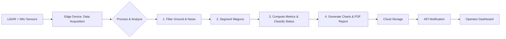

# Intelligent Wagon Load Analysis & Reporting System (IWLARS)

## 1. Detailed Introduction/Explanation of the Project

The **Intelligent Wagon Load Analysis & Reporting System (IWLARS)** is an end-to-end automated system designed to analyze the contents of moving train wagons. Its primary purpose is to provide accurate, real-time data on wagon loads, which is critical for logistics, safety, and resource management in the railway industry.

**Real-World Use Case:**
Imagine a mining or shipping company that needs to transport bulk materials like coal, ore, or grain. Overloading wagons can cause track damage and safety hazards, while underloading leads to inefficiency and financial loss. IWLARS solves this by using LiDAR (Light Detection and Ranging) and IMU (Inertial Measurement Unit) sensors to scan each wagon as the train passes a checkpoint. The system then calculates key metrics such as material volume, estimated weight, and load balance, flagging any anomalies like overloading or uneven distribution. Finally, it generates a comprehensive PDF report for each train, allowing operators to make immediate, data-driven decisions.

**Key Technologies:**
- **Language:** Python 3.10+
- **Data Processing:** Open3D, NumPy, Pandas
- **API:** FastAPI
- **Report Generation:** WeasyPrint (HTML to PDF), Matplotlib
- **Cloud Storage:** AWS S3 or Google Firebase
- **Deployment:** Docker, GitHub Actions

## 2. Basic Development Steps Required to Build the Project

Building IWLARS involves a structured, phased approach. The development can be broken down into four main weeks.

**Week 1: Environment & Sensor I/O**
1.  **Project Setup:** Initialize a Git repository, create the folder structure (`src`, `tests`, `docs`), and define dependencies in `requirements.txt`.
2.  **Sensor Simulation:** Implement a data loader in `src/sensors/data_loader.py` to read sample LiDAR (.pcd) and IMU (.csv) files. This simulates real-time data input.
3.  **Initial Validation:** Write a basic script in `src/main.py` to load and visualize a point cloud using Open3D to ensure the environment is working correctly.

**Week 2: Preprocessing & Segmentation**
1.  **Ground & Noise Filtering:** In `src/processing/filter_ground.py`, implement a RANSAC algorithm to detect and remove the ground plane from the point cloud. Add a noise filter to clean up stray points.
2.  **Wagon Segmentation:** In `src/processing/segment_wagons.py`, develop a method (e.g., Euclidean clustering or gap detection) to separate the continuous point cloud stream into individual clouds, each representing one wagon.

**Week 3: Analytics & Charting**
1.  **Core Metrics:** In `src/analytics/compute_metrics.py`, calculate the volume of the material in each wagon using a convex hull. Estimate weight based on a configurable material density.
2.  **Status Classification:** In `src/analytics/classify_status.py`, define rules to classify each wagon as `Normal`, `Empty`, `Overloaded`, or `Unbalanced` based on the computed metrics.
3.  **Chart Generation:** Use Matplotlib in `src/reports/charts.py` to generate visual representations (pie charts, bar graphs, etc.) of the analysis.

**Week 4: Report, API & Deployment**
1.  **PDF Report Generation:** Create an HTML template (`src/reports/templates/report.html`) and use WeasyPrint in `src/reports/generate_report.py` to populate it with data and charts, converting it to a PDF.
2.  **API Endpoints:** Using FastAPI in `src/api/main_api.py`, create endpoints to trigger a scan (`POST /scan`) and retrieve a generated report (`GET /report/{scan_id}`).
3.  **Containerization:** Write a `Dockerfile` to package the application, making it easy to deploy consistently across different environments.

## 3. Basic Project Structure

The project is organized into a modular structure to separate concerns and improve maintainability.

```
iwlars/
│
├── src/                    # Main source code
│   ├── sensors/            # LiDAR/IMU data interfaces and simulators
│   ├── processing/         # Point cloud filtering and segmentation logic
│   ├── analytics/          # Metrics calculation and status classification
│   ├── reports/            # PDF and chart generation
│   ├── api/                # FastAPI endpoints
│   ├── main.py             # Main pipeline entry point
│   └── utils.py            # Shared utility functions
│
├── data/                   # Sample and generated data
│   ├── raw/                # Raw sensor data for simulation
│   ├── processed/          # Intermediate data (e.g., segmented wagons)
│   └── reports/            # Final generated PDF reports
│
├── tests/                  # Unit and integration tests
├── optional_frontend/      # Optional React-based dashboard for viewing reports
├── Dockerfile              # Containerizes the application for deployment
└── requirements.txt        # Python package dependencies
```

## 4. System Workflow (Technical Workflow)

The system operates in a sequential pipeline, transforming raw sensor data into an actionable report.



1.  **Data Acquisition:** LiDAR and IMU sensors, mounted near the track, capture point cloud and motion data as a train passes. This data is streamed to an on-site edge device.
2.  **Processing:** The Python application running on the edge device ingests the data stream.
    -   **Filtering:** The ground plane and sensor noise are removed.
    -   **Segmentation:** The data is split into distinct point clouds for each wagon.
3.  **Analysis:** For each wagon, the system calculates its volume, estimates weight, and assesses load balance.
4.  **Reporting:** The results are compiled into an HTML report, which is then rendered as a PDF. The report includes summary statistics, per-wagon details, and visualizations.
5.  **Distribution:** The final PDF is uploaded to a cloud storage bucket (AWS S3 or Firebase), and a notification (e.g., API callback) is sent with a link to the report.

## 5. User Workflow (End-User Interaction)

The end-user, typically a site operator or manager, interacts with the system in a simple, automated flow.

```text
[Train Approaches Checkpoint]
       ↓ (System automatically detects train and starts scan)
[Scanning & Processing Occurs Automatically]
       ↓ (A few moments after the train passes)
[Operator Receives Notification (Email or Dashboard Alert)]
       ↓
[Operator Clicks Link to View or Download PDF Report]
       ↓
[Operator Reviews Report for Anomalies (e.g., Overloaded Wagons)]
```

1.  **Automated Trigger:** The process begins automatically when a train is detected by a hardware sensor or software-based monitoring.
2.  **Hands-Off Processing:** The operator does not need to intervene. The system handles the scanning, analysis, and report generation in the background.
3.  **Notification:** Once the report is ready, the operator receives a direct link. This can be via email, a message to a company chat system, or an alert in the web dashboard.
4.  **Access & Action:** The operator opens the report from any device to review the train's load status. If the optional dashboard is deployed, they can also log in to view a history of all scans, filter results, and track trends over time.
        