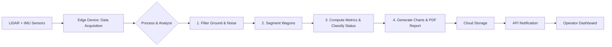

# System and User Workflow

## 1. System Workflow (Technical Workflow)

The IWLARS system is an end-to-end, automated pipeline that transforms raw sensor data from passing trains into actionable, cloud-delivered reports. The workflow is designed for reliability, scalability, and minimal operator intervention, leveraging modern data processing, analytics, and cloud technologies.

### 1.1. High-Level Pipeline Overview



### 1.2. Detailed Step-by-Step Workflow

1. **Data Acquisition**
    - **Sensors:** LiDAR and IMU sensors are mounted trackside at a checkpoint. As a train passes, these capture high-frequency point cloud and motion data.
    - **Edge Device:** An on-site computer (edge device) receives the sensor stream in real time.
    - **Simulation:** For development/testing, sequential `.pcd`, `.las` (LiDAR) and `.csv` (IMU) files are placed in `data/raw/frames/` and loaded at fixed intervals to mimic real-time arrival.

2. **Preprocessing**
    - **Ground & Noise Filtering:**
        - The system removes the ground plane using RANSAC or similar algorithms (`src/processing/filter_ground.py`).
        - Noise is filtered to clean up stray points, ensuring only relevant data is processed.
    - **Wagon Segmentation:**
        - The continuous point cloud is split into individual wagons using clustering or gap detection (`src/processing/segment_wagons.py`).

3. **Analytics**
    - **Metric Computation:**
        - For each wagon, the system computes volume (via convex hull), estimates weight (using configurable material density), and assesses load balance (`src/analytics/compute_metrics.py`).
    - **Status Classification:**
        - Wagons are classified as `Normal`, `Empty`, `Overloaded`, or `Unbalanced` based on thresholds and rules (`src/analytics/classify_status.py`).
    - **Visualization:**
        - Charts (pie, bar, etc.) are generated using Matplotlib (`src/reports/charts.py`).

4. **Report Generation**
    - **HTML Report:**
        - Results are compiled into a styled HTML report, including summary statistics, per-wagon details, and visualizations.
    - **PDF Conversion:**
        - The HTML report is rendered as a PDF using WeasyPrint or ReportLab for distribution and archival.

5. **Cloud Integration & Notification**
    - **Upload:**
        - The PDF report is uploaded to a cloud storage bucket (AWS S3 or Firebase) for secure access and backup.
    - **API Notification:**
        - An API callback or message is sent to notify the operator, including a direct link to the report.
    - **Dashboard (Optional):**
        - If deployed, a React/Next.js dashboard allows browsing historical reports, filtering results, and tracking trends.

### 1.3. System Structure Reference

```
project_root/
├── src/
│   ├── sensors/         # Data loading, sensor interfaces
│   ├── processing/      # Filtering, segmentation
│   ├── analytics/       # Metric computation, classification
│   ├── reports/         # Charting, PDF generation
│   └── main.py          # Pipeline entry point
├── data/
│   └── raw/frames/      # Sample/simulated sensor data
├── docs/
│   └── ...              # Documentation, sample reports
```

## 2. User Workflow (End-User Interaction)

The end-user, typically a site operator or manager, experiences a seamless, automated process:

```text
[Train Approaches Checkpoint]
       ↓ (System automatically detects train and starts scan)
[Scanning & Processing Occurs Automatically]
       ↓ (A few moments after the train passes)
[Operator Receives Notification (Email or Dashboard Alert)]
       ↓
[Operator Clicks Link to View or Download PDF Report]
       ↓
[Operator Reviews Report for Anomalies (e.g., Overloaded Wagons)]
```

- **Automated Trigger:** The process starts when a train is detected by hardware or software sensors.
- **Hands-Off Processing:** The operator does not intervene; the system handles scanning, analysis, and reporting.
- **Notification:** Once the report is ready, the operator receives a direct link via email, chat, or dashboard alert.
- **Access & Action:** The operator reviews the report for anomalies and can access historical data via the dashboard if deployed.

## 3. Real-World Workflow & Deployment Considerations

- **Field Deployment:**
    - Sensors and edge device are installed at a fixed checkpoint.
    - The system is robust to weather, vibration, and power fluctuations.
- **Operator Experience:**
    - Minimal training required; the system is designed for reliability and ease of use.
    - Reports are accessible from any device with internet access.
- **Scalability:**
    - The architecture supports scaling to multiple checkpoints and integration with central analytics platforms.
- **Security:**
    - Data is encrypted in transit and at rest; access to reports is controlled via secure links or dashboard authentication.

## 4. Example Workflow Diagram (ASCII)

```
[Sensors] -> [Edge Device] -> [Preprocessing] -> [Analytics] -> [Report Generation] -> [Cloud Storage] -> [Operator Notification]
```